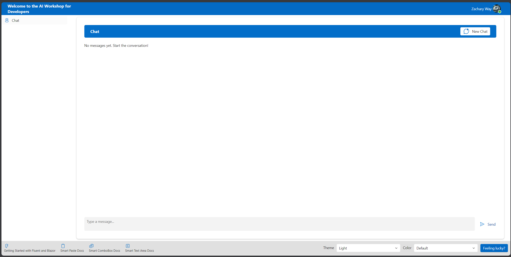

### [< Back to Challenge 2](../../Challenge-02.md) - [Next Pre-requisite >](../../Challenge-02-Reference-App.md)

# Creating Application Registration in Entra

# Build a Blazor Server web app that signs in users with Microsoft identity

This sample demonstrates how to build a Blazor Server web application that signs in users with Microsoft identity. The application uses the Microsoft identity platform to sign in users and obtain an access token to call the Microsoft Graph API. The application uses the Microsoft Authentication Library (MSAL) to sign in users and obtain an access token to call the Microsoft Graph API.

## Register the application and record identifiers

To complete registration, provide the application a name and specify the supported account types. Once registered, the application **Overview** pane displays the identifiers needed in the application source code.

1. Sign in to the [Microsoft Entra admin center](https://entra.microsoft.com).
1. If you have access to multiple tenants, use the **Settings**   in the top menu to switch to the tenant in which you want to register the application from the **Directories + subscriptions** menu.
1. Browse to **Identity** > **Applications** > **App registrations**, select **New registration**.
1. Enter a **Name** for the application, such as *identity-client-web-app*.
1. For **Supported account types**, select **Accounts in this organizational directory only**. For information on different account types, select the **Help me choose** option.
1. Select **Register**.

     

1. The application's **Overview** pane is displayed when registration is complete. Record the **Directory (tenant) ID** and the **Application (client) ID** to be used in your application source code.

    

## Add a platform redirect URI

To specify your app type to your app registration, follow these steps:

1. Under **Manage**, select **Authentication**.
1. On the **Platform configurations** page, select **Add a platform**, and then select **Web** option.
1. For the **Redirect URIs** enter `https://localhost:7118/signin-oidc`.
1. Under **Front-channel logout URL**, enter `https://localhost:7118/signout-oidc` for signing out.
1. Select **Configure** to save your changes.

## Create a secret for the application

To create a secret for the application, follow these steps:

1. Under **Manage**, select **Certificates & secrets**.
1. Under **Client secrets**, select **New client secret**.
1. Enter a description for the secret, select an expiration period, and then select **Add**.
1. Record the secret value. You will use this value in your application source code.

## Configure the project

1. In your IDE, open the `BlazorAI.sln` solution in VS code or Visual Studio.
1. Open *appsettings.json* in the `BlazorAI` project (in the `BlazorAI` folder if you're in VS Code) and replace the following values for the keys below:

    * `TenantId` - The identifier of the tenant where the application is registered. Replace the text in quotes with the `Directory (tenant) ID` that was recorded earlier from the overview page of the registered application.
    * `ClientId` - The identifier of the application, also referred to as the client. Replace the text in quotes with the `Application (client) ID` value that was recorded earlier from the overview page of the registered application.
    * `ClientSecret` - The secret value that was recorded earlier from the registered application.

## Run the application and sign in

1. In your project directory, use the terminal to enter the following command;

    1. If in Visual Studio just press `F5` to run the application. The browser will open automatically. 
    2. Otherwise, navigate to the `src/BlazorAI` folder run the following commands in the terminal.

        ```console
        dotnet restore
        ```

        ```console
        dotnet run
        ```

        1. Copy the `https` URL that appears in the terminal, for example, `https://localhost:7118/`, and paste it into a browser (or you can Ctrl+Left Click on the URL to launch in your last focused browser instance). We recommend using a private or incognito browser session, or a non-work profile.
        2. Follow the steps and enter the necessary details to sign in with your Microsoft account (If you are using an Azure Pass, make sure you use the same account). You're requested to provide an email address so a one time passcode can be sent to you. Enter the code when prompted.
        3. The application requests permission to maintain access to data you have given it access to, and to sign you in and read your profile. Select **Accept**.
        4. The following screenshot appears, indicating that you have signed in to the application and have accessed your profile details from the Microsoft Graph API.
        

## Sign-out from the application

1. Find the **Sign out** link in the top right corner of the page, and select it.
1. You're prompted to pick an account to sign out from. Select the account you used to sign in.
1. A message appears indicating that you signed out. You can now close the browser window.


## Success Criteria

1. App Setting file has been updated with the TenantId, ClientId, and ClientSecret.
1. You are able to run the application and sign in with your Microsoft account.

### [< Back to Challenge 2](../../Challenge-02.md) - [Next Pre-requisite >](../../Challenge-02-Reference-App.md)
