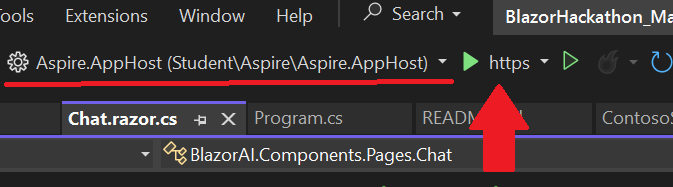
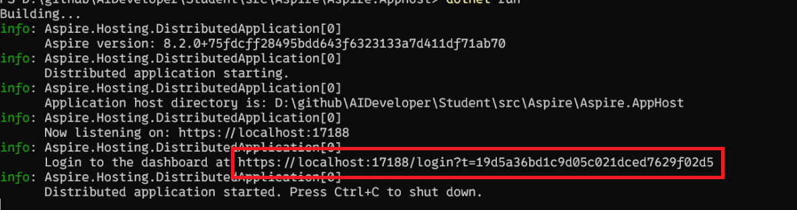
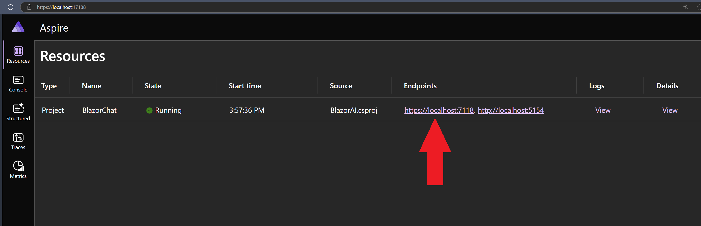
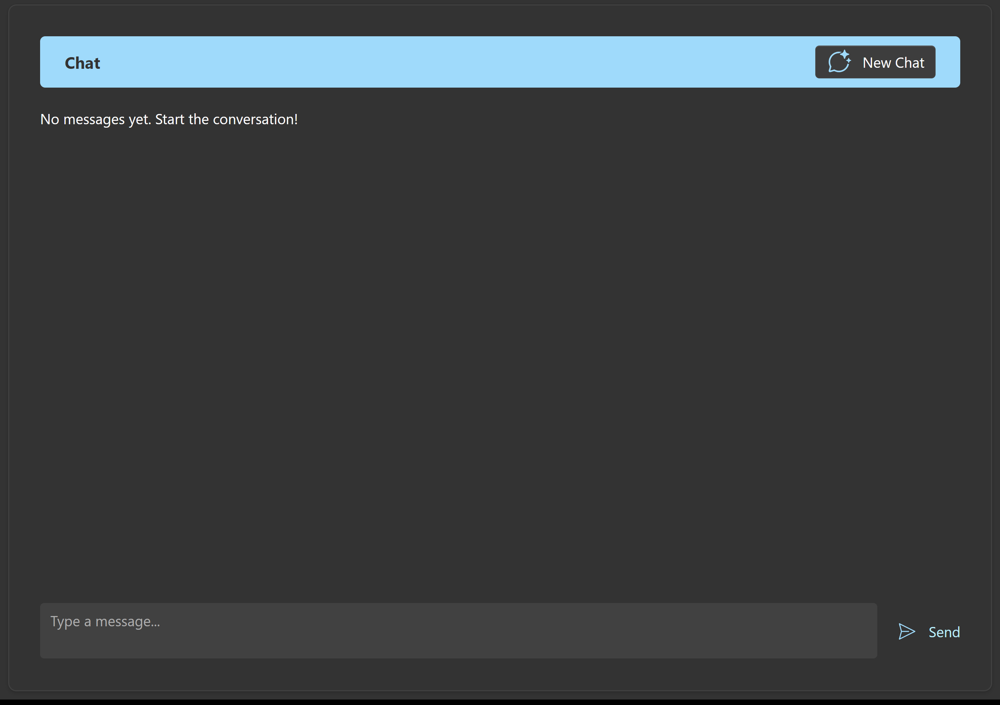
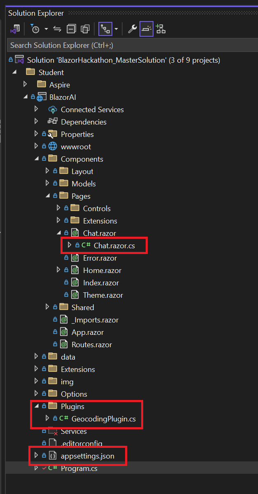

### [< Back to Challenge 2](../../Challenge-02.md)

# Getting Familiar With the Reference Application

This application was created as a sample application that allow you to focus on learning Semantic Kernel and Azure OpenAI. The application is a simple chat application that uses the Semantic Kernel framework to interact with an AI model. The AI model is an Azure OpenAI chat model. The application is a .Net 8 Blazor Server application that uses the Aspire Framework which is a beginner friendly distribution orchestration framework to host the application. The application is a simple chat window that allows users to interact with the AI model by typing a question or prompt and pressing the **Send** key or pressing **Cntl + Enter**. The AI model will then respond with an answer or completion to the prompt. The application uses the Semantic Kernel framework to interact with the AI model. You will need to complete the implementation of the chat API to send the user's prompt to the AI model and return the response to the user.

1. From the project root directory you will find a solution file ending in `.sln`. Open this file in Visual Studio. If you are using Visual Studio Code, navigate to the src folder and open this folder in Visual Studio Code.
1. To build the application press the play button in Visual Studio. This should launch the Aspire.AppHost. Ensure that you have the `Aspire.AppHost` configuration selected in the drop down shown on the left, and that `https` is selected in the runtime config dropdown next to the play button.

    

    If you are using Visual Studio Code, you can run the application by executing the following command in the terminal from the root of your repository.

    ```console
    cd src\Aspire\Aspire.AppHost
    dotnet dev-certs https --trust
    dotnet run
    ```

    You'll then see your Kestrel host start. You can Ctrl+Left Click on the `Login to the dashboard at...` link to launch the Aspire Dashboard (or copy and paste into your browser)

    

    1. An Aspire Application will launch. You should see your chat application running. Select the link to launch your chat application. To learn more about Aspire, refer to the documentation [here](https://learn.microsoft.com/en-us/dotnet/aspire/get-started/aspire-overview).

        

    The application should start and display a chat window. In a similar manner to using the Azure Open AI Studio in the previous challenge, you can interact with the chat window by typing a question or prompt and pressing the **Send** key. Currently, the application will respond with an error message because the AI Model has not been configured.

    

1. Note the only files you will be working with for the next few challenges are seen in this screenshot. The `Chat.razor.cs` file is where you will be making changes to complete the challenges.

    

1. Open the `Chat.razor.cs` file

    At the heart of the Semantic Kernel framework is the **Kernel** object. Here is where you register the AI Models you will be working with and any Plugins you will be using in your application. You will learn about Plugins in later challenges.

    The Kernel object is being configured to use an Azure OpenAI chat model by calling the ```AddAzureOpenAIChatCompletion``` method of the Kernel Builder class.  

    Locate the following code in the ```Chat.razor.cs```:

    ```CSharp
    //Configure Semantic Kernel
    var kernelBuilder = Kernel.CreateBuilder();
    ```

    Now that you know the basics of the reference application, you are ready to start the first challenge. If you have completed the other prerequisites and challenges, you are ready to move on to the next challenge. [BEGIN!](../../Challenge-02.md#challenges)

## Success Criteria

1. You found the kernel in the `Chat.razor.cs` file.

### [< Back to Challenge 2](../../Challenge-02.md)
