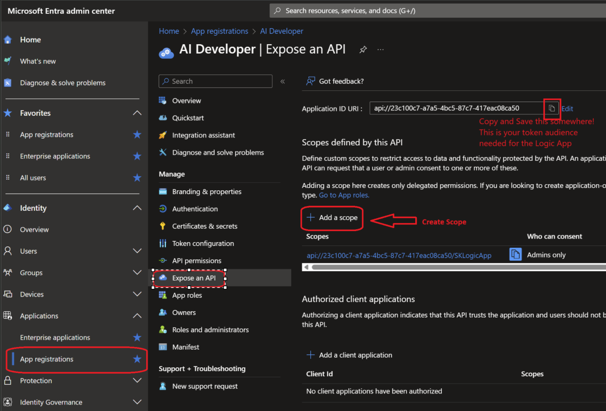
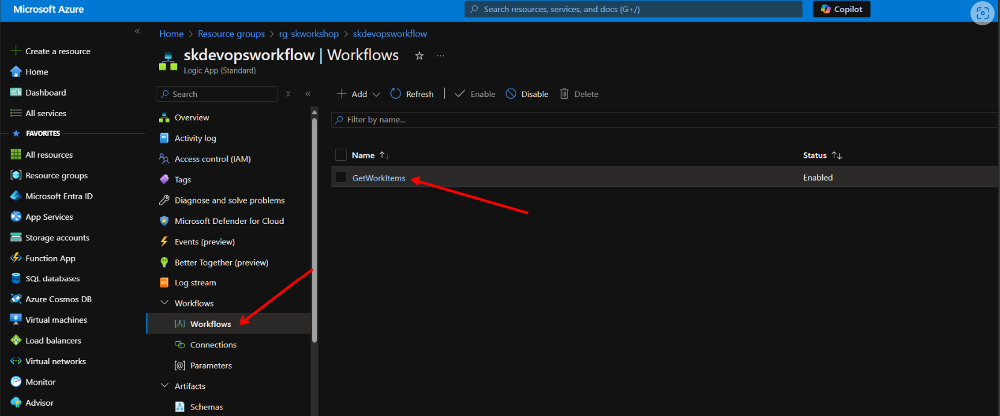

### [< Back to Challenge](../../Challenge-04.md) - **[Home ](../../../README.md)** [>]()

# Challenge 04 Pre-requisites - Setup Azure Logic Apps

## Create Logic App

1. Open the Azure Portal and search for `Logic App` in the search bar.
1. Click on `Logic Apps` and Add a new Logic App.
1. Under the  `Standard` section select `Workflow Service Plan` and click on `Select`.
1. Place it in the same resource group as Azure Open AI resource.
1. Create a new Windows Plan.
1. Pick a location and click on `Review + Create` then `Create`.
1. Once the Logic App is created, click on `Go to resource`.

## Enable Access to Logic App

1. Modify Logic App Host.json file.
2. Update App Registration for the Logic App.
3. Turn on EasyAuth by assigning the App Registration to the Logic App.
4. Add code to program.cs to login and acquire a token for Logic Apps.

### Modify Logic App Host.json file

This step will allow the App Service which hosts the Logic App to accept anonymous requests.

1. In the Logic App under development tools, click on `Advanced Tools` then `Go`.

    

1. Click on `Debug Console` then `CMD`.
1. Navigate to `site/wwwroot` and edit the file called `host.json`.

    

1. Click the edit icon for the host.json file.

    

1. Replace all the code in the file with the code below and click on `Save`.

    ```json
    {
        "version": "2.0",
        "extensionBundle": {
            "id": "Microsoft.Azure.Functions.ExtensionBundle.Workflows",
            "version": "[1.*, 2.0.0)"
        },
        "extensions": {
            "http": {
                "routePrefix": ""
            },
            "workflow": {
                "MetadataEndpoints": {
                    "plugin": {
                        "enable": true,
                        "Authentication": {
                            "Type": "Anonymous"
                        }
                    },
                    "openapi": {
                        "enable": true,
                        "Authentication": {
                            "Type": "Anonymous"
                        }
                    }
                },
                "Settings": {
                    "Runtime.Triggers.RequestTriggerDefaultApiVersion": "2020-05-01-preview"
                }
            }
        }
    }
    ```

### Update App Registration for the Logic App

This step will will be used to give users and applications permissions to the Logic App.

1. Navigate to the [Entra](https://entra.microsoft.com/) website and sign in with your Microsoft account.
1. Click on `App Registrations` then select the previously created Azure Open AI app registration. If you have forgotten what it is, reference [Entra Pre-Req](../../Challenge-02.md) from Challenge 2.
1. Use this image as a reference to find the App Registration. Added a Scope for the Logic App and copy the Application URI.

    

    1. Under Expose an API click on `Add a scope`.
    1. Fill in the fields with the following information and click on `Add scope`.

        - `Scope name`: ``` SKLogicApp ```
        - `Who can consent?`: ``` Admins and users ```
        - `Admin consent display name`: ``` Access the Logic App ```
        - `Admin consent description`: ``` Allows the app to access the Logic App on behalf of the signed-in user. ```
        - `User consent display name`: ``` Access the Logic App ```
        - `User consent description`: ``` Allows the app to access the Logic App on your behalf. ```

    1. Copy the `Application ID URI` and save it for later. This will be used in the Logic App.
    1. Before you leave the App Registration, ensure you have these items written down.

        - `Tenant ID`
        - `Client ID`
        - `Application ID URI` (This is the Token Audience without the Scope)

### Turn on EasyAuth by assigning the App Registration to the Logic App

This will allow the Logic App to accept tokens from the App Registration.

1. Navigate back to the Logic App in the Azure Portal.
1. Under `Settings` click on `Authentication` then click on `Add identity provider`.
1. Select `Microsoft` and click on `Add`.
1. Using the information from the App Registration, fill in the following fields:
    - Paste the *Client ID* from the App Registration.
    - Issuer URL
        - Copy this ``` https://sts.windows.net/{yourtenantid} ``` and replace *{yourtenantid}* with your tenant id.
    - *Allowed token audiences* 
        - Paste the *Application ID URI* from the App Registration.
1. Next the 3 selections will be as follows:
    - `Allow requests only from this application itself`
    - `Allow requests from any identity`
    - `Use default restrictions based on issuer`
1. Click on `Add`.

## Logic App Workflow

1. Navigate back to the Logic App in the Azure Portal.
1. Under `Workflow` click on `Workflows` then click on `Add`.
1. Give it a name like `GetWorkItems` and click on `Stateless` then `Create`.
1. Navigate to your newly created workflow.
    
1. In the Overview tab turn on `Enable Debug Mode`.

    

1. Expand Developer, Click on `Designer` then click on `Add a trigger`.

    

1. Search for `Request` and click on `When an HTTP request is received`.
1. Change the Verb to Post.

    

1. Next click on `Add an action` and search for `Azure DevOps` then click on `Get query results`. In the future you can swap this out for a different action. Right now we are getting you to a working Logic App.

    

    :bulb: You may need to select "See more" when searching for Azure DevOps

    

1. Click on `Sign in`, if you have a popup blocker you might have to allow popups.

    

1. Select the organization and project you created earlier and then navigate to the `Assigned to me` query as seen below. Or use any query you like that is available in the Azure DevOps project.

    

1. Click on `Add an action` and search for `Request` then click on `Response`.

    

1. In the body text field we will use dynamic content to add the `Body` from the `Get query results` action to the `Body` of the `Response` action. Click the Lightning bolt below and select `Body`

    

1. Save your Logic App. Now a url will be generated on the `When an HTTP request is received` trigger. Copy this url. Paste it in a browser or HTTP client like Postman to test the Logic App.

    

1. Lastly, you will need the swagger URI for the challenge. Using the URL you copied from the last step, replace everything after `.net/` with `swagger.json`. This will give you the swagger URI for the Logic App. Here is an example:

    ```csharp
    // Before
    "https://aoai2.azurewebsites.net:443/get_work_items/triggers/get_workitems/invoke?api-version=2022-05-01&sp=Sample%2Frun&sv=1.0&sig=samplesignature"

    // After
    "https://aoai2.azurewebsites.net/"
    ```

## Success Criteria

1. Successfully create a new Logic App in the Azure Portal.
1. Successfully call the Logic App from a HTTP client like Postman.

### **[Next](../../Challenge-04.md)** [>]()
