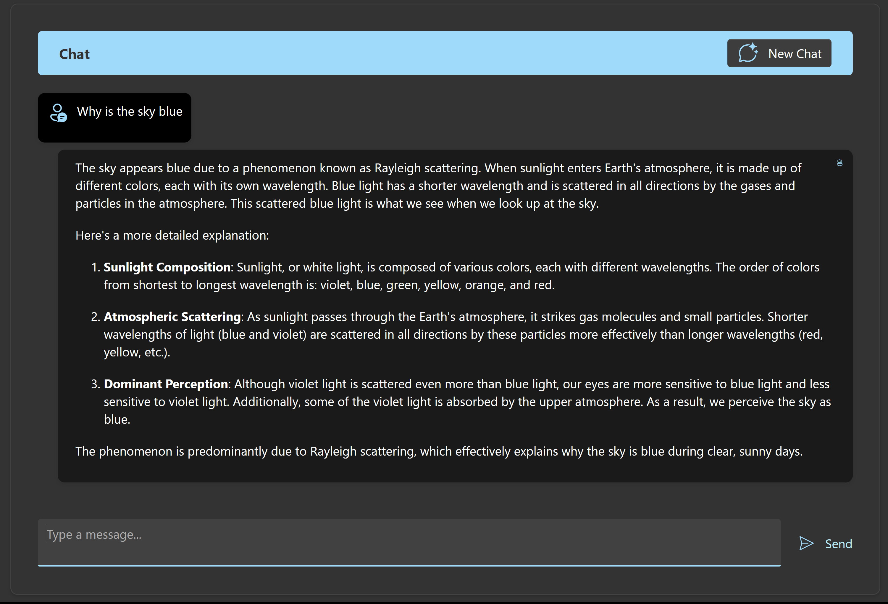

### [< Previous Challenge](./Challenge-01.md) - [**Home**](../README.md) - [Next Challenge >](./Challenge-03.md)

# Challenge-02 - Semantic Kernel Fundamentals

## Introduction

The first step in understanding Semantic Kernel is to become familiar with the basics. Semantic Kernel is a lightweight, open-source development kit designed to help developers build AI-infused applications using the latest AI models. It supports languages like C#, Python, and Java, making it versatile for various development environments. Semantic Kernel provides a simple and consistent API for developers to interact with several different AI models, including GPT-3.5, GPT-4, Meta-Llama, DALL·E, and many more. You can use Semantic Kernel to build applications that can generate text, images, sound, and even code. Models can be hosted locally or in the cloud, and you can use the same API to interact with them.

## Description

In this challenge, you will be provided with a starter application that will require you to complete the implementation of the chat feature using Semantic Kernel and the Azure OpenAI GPT-4o model. The AI model will then respond with an answer or completion to the prompt. The application uses the Semantic Kernel framework to interact with the AI model. You will need to complete the implementation of the chat API to send the user's prompt to the AI model and return the response to the user.

## Prerequisites

1. Complete the [Getting Familiar With the Reference Application](./Resources/Supporting%20Challenges/Challenge-02-Reference-App.md) beginner guide.

## Challenges

### Implementation Steps

1. Deploy a GTP-4o model using  [Azure Open AI Studio](https://oai.azure.com) `https://oai.azure.com`. The **Deployment name** should be something similar to ``` gpt-4o ```. This name will be needed next when configuring Semantic Kernel. :exclamation: Deployment type should be **Standard**. :exclamation:

1. Update the *.env* file with the Azure OpenAI *Deployment name*, *Endpoint URL* and the *API Key*. These values can be found in the Azure OpenAI Studio.

    :bulb: **The endpoint URL should be in the format** ```https://<deployment-name>.openai.azure.com```

    **.env*

    ```json
    "AZURE_OPENAI_CHAT_DEPLOYMENT_NAME": "Replace with your AOI deployment name",
    "AZURE_OPENAI_ENDPOINT": "Replace with your AOI endpoint",
    "AZURE_OPENAI_API_KEY": "Replace with your AOI API key",
    ```

1. Navigate to the `chat.py` and Implement the following code to add the Azure OpenAI Chat Completion service to the Kernel object.

    ```python
    //Add Azure OpenAI Chat Completion
    chat_completion_service = AzureChatCompletion(
        deployment_name="my-deployment",  
        api_key="my-api-key",
        endpoint="my-api-endpoint", # Used to point to your service
        service_id="my-service-id", # Optional; for targeting specific services within Semantic Kernel
    )
    
    # You can do the following if you have set the necessary environment variables or created a .env file
    chat_completion_service = AzureChatCompletion(service_id="my-service-id")
    ```


1. Locate the code comment `// Challenge 02 - Chat Completion Service` in the `chat.py` file.

    :bulb: [Retrieving chat completion services](https://learn.microsoft.com/en-us/semantic-kernel/concepts/ai-services/chat-completion/?tabs=python-AzureOpenAI%2Cpython-AzureOpenAI%2Cjava-AzureOpenAI&pivots=programming-language-python#retrieving-chat-completion-services)

    :pushpin:  The kernel itself doesn't expose AI functionality directly - instead, it manages services that do. When we want to send messages to the AI, we need to obtain a reference to the chat service specifically (kernel.Services).

### Implement SendMessage Method


1. Add the **user's message** to the chat history collection.

    In the `chat.py` file, Below the comment `// Start Challenge 02 - Sending a message to the chat completion service`, add the user's prompt from the `ChatRequest` object to the chat history collection.

    :pushpin: The chat history maintains a record of the conversation between user and AI. By adding each message to this history, we give the AI context about the ongoing conversation, allowing it to provide more relevant and coherent responses.

    :bulb: For a detailed explanation of Chat History, please refer to the documentation [here](https://learn.microsoft.com/en-us/semantic-kernel/concepts/ai-services/chat-completion/chat-history?pivots=programming-language-python).

1. Use the Chat Completion service to send the entire chat history, including the latest prompt, to the Azure OpenAI chat service. Once the service processes this and generates a response, wait until the full response is received before sending it back to the client.

    :bulb: Refer to the Semantic Kernel documentation [here](https://learn.microsoft.com/en-us/semantic-kernel/concepts/ai-services/chat-completion/?tabs=python-AzureOpenAI%2Cpython-AzureOpenAI%2Cjava-AzureOpenAI&pivots=programming-language-python#using-chat-completion-services) for an example of how to call the chat completion service.

    1. Now add the **AI's Response** *Content* to the Chat History collection.

       
       :pushpin: We add both user messages and AI responses to the same chat history collection, but with different roles (User vs Assistant). This maintains the conversation context for future AI responses.

       :bulb: To see how the ChatHistory object works in detail, see the documentation [here](https://learn.microsoft.com/en-us/semantic-kernel/concepts/ai-services/chat-completion/chat-history?pivots=programming-language-python#creating-a-chat-history-object)

### Testing

1. Run the application and test the chat completion by submitting the prompt:

    ```text
    Why is the sky blue?
    ```

    The response should be similar to the following
    
    :bulb: For more information on the Semantic Kernel, refer to the documentation [here](https://learn.microsoft.com/en-us/semantic-kernel/concepts/kernel?pivots=programming-language-python).

1. Test the Chat History by submitting the following prompt without refreshing the browsing window and clearing the chat history.

    ```text
    Why is it red?
    ```

    If the chat history is working, the AI will understand the context of the next question  and provide a relevant response.

    If you refresh the browser window or click `New Chat`, the AI will not have the context of the previous question and will not provide a relevant response. So then you would have to provide the context again by asking the question:

    ```text
    Why is the sky red?
    ```

    :bulb: For more information on Chat History, refer to the documentation [here](https://learn.microsoft.com/en-us/semantic-kernel/concepts/ai-services/chat-completion/chat-history?pivots=programming-language-python).

1. Test the application with a variety of prompts to ensure it responds appropriately.

## Success Criteria

- Configuration
  - [ ] Deployed GPT model in Azure OpenAI Studio
  - [ ] Added deployment name, endpoint URL, and API key to appsettings.json
- Kernel Setup
  - [ ] Registered chat completion service with kernel builder
  - [ ] Built kernel instance
  - [ ] Retrieved chat completion service using GetRequiredService
- Message Handling
  - [ ] Implemented adding user messages to chat history
  - [ ] Successfully calling chat completion service
  - [ ] Adding AI responses to chat history
- Testing
  - [ ] "Why is the sky blue" returns a coherent response
  - [ ] "Why is it red" demonstrates chat history is working
  - [ ] AI responds appropriately to follow-up questions


## Learning Resources

[Understanding the kernel](https://learn.microsoft.com/en-us/semantic-kernel/concepts/kernel?pivots=programming-language-python)

[Chat completion](https://learn.microsoft.com/en-us/semantic-kernel/concepts/ai-services/chat-completion/?tabs=python-AzureOpenAI%2Cpython-AzureOpenAI%2Cjava-AzureOpenAI&pivots=programming-language-python)

[Chat history](https://learn.microsoft.com/en-us/semantic-kernel/concepts/ai-services/chat-completion/chat-history?pivots=programming-language-python)

[What is a Planner?](https://learn.microsoft.com/en-us/semantic-kernel/concepts/planning?pivots=programming-language-python)

### [< Previous Challenge](./Challenge-01.md) - **[Home](../README.md)** - [Next Challenge >](./Challenge-03.md)
