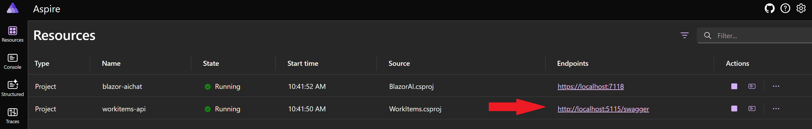
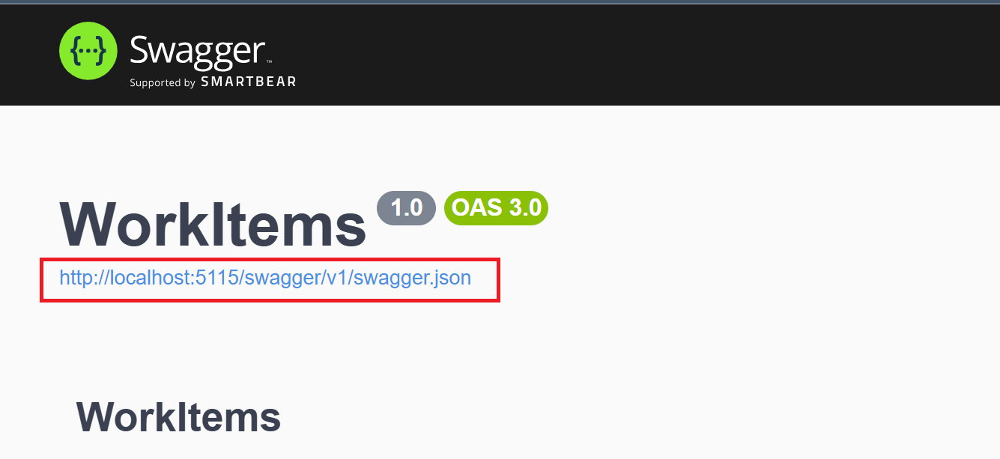

### [< Previous Challenge](./Challenge-03.md) - **[Home](../README.md)** - [Next Challenge >](./Challenge-05.md)

# Challenge 04 -  Import Plugin using OpenAPI

## Introduction

OpenAPI is a widely adopted standard for describing RESTful APIs in a way that is both human-readable and machine-friendly. It streamlines API integration by providing automatic documentation, client SDK generation, and reduced manual coding efforts. By leveraging OpenAPI specifications, Semantic Kernel can dynamically load external services as plugins, letting your AI-driven apps discover, invoke, and orchestrate these APIs more effectively. 

As developers, we can enrich our applications by integrating various APIs through OpenAPI specifications. In this challenge, you will learn how to import the provided **WorkItems API** as an OpenAPI plugin in Semantic Kernel and interact with it through AI-driven prompts.

>NOTE: You have an existing OpenAPI spec for the WorkItems API. Make sure to locate it and use it when configuring your Semantic Kernel plugin.

### Description

This challenge will introduce you to how to import OpenAPI API as Semantic Kernels Plugins in C#, and how to chain plugins using the Auto Function Calling capabilities of Semantic Kernel.

1. Launch your AI Chat app, and ask the bot `What are my work items?`
    - Test the prompt "What are my work items?" see how it responds.
1. You will be adding a new plugin to your Semantic Kernel using the API provided in the workshop.
    - Import the API into Semantic Kernel.

        :bulb: [Adding the OpenAPI plugin](https://learn.microsoft.com/en-us/semantic-kernel/concepts/plugins/adding-openapi-plugins?pivots=programming-language-csharp#adding-the-openapi-plugin)

        :exclamation: We have created the API for you to use in this challenge. You can find the OpenAPI spec by going to the swagger webpage from Aspire or starting the API from your local machine.

        1. Open Aspire and navigate to the Swagger page.
        

        1. Copy the OpenAPI spec url from the Swagger page.
        

        :exclamation: Semantic Kernel SDK for OpenAPI's - your plugin name must be 64 characters or less.

    - Test the prompt "What are my work items?" see how it responds.
1. _(Optional)_ Do you have another API you would like to integrate with? Try importing it as a plugin.

## Success Criteria

1. Your chat bot should be able to answer the question "What are my work items?" with a list of work items from the API.
1. You can ask the bot to filter, sort, group, or change the display format of the work items.
1. _(Optional)_ Test other CRUD operations on the WorkItems API and try chaining multiple operations together.

## Additional Learning Resources

[Add Logic Apps as plugins](https://learn.microsoft.com/en-us/semantic-kernel/concepts/plugins/adding-logic-apps-as-plugins)

[OpenApiFunctionExecutionParameters](https://learn.microsoft.com/en-us/dotnet/api/microsoft.semantickernel.plugins.openapi.openapifunctionexecutionparameters?view=semantic-kernel-dotnet)

[ImportPluginFromOpenApiAsync](https://learn.microsoft.com/en-us/dotnet/api/microsoft.semantickernel.plugins.openapi.openapikernelextensions.importpluginfromopenapiasync?view=semantic-kernel-dotnet)

### [< Previous Challenge](./Challenge-03.md) - **[Home](../README.md)** - [Next Challenge >](./Challenge-05.md)
