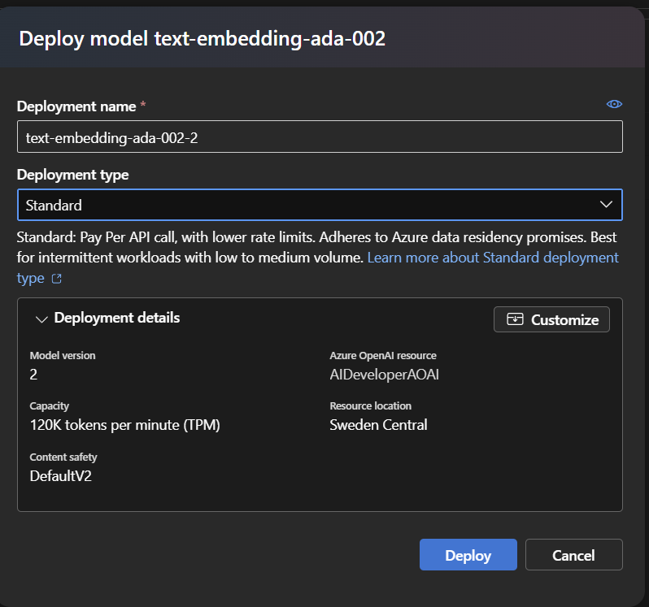
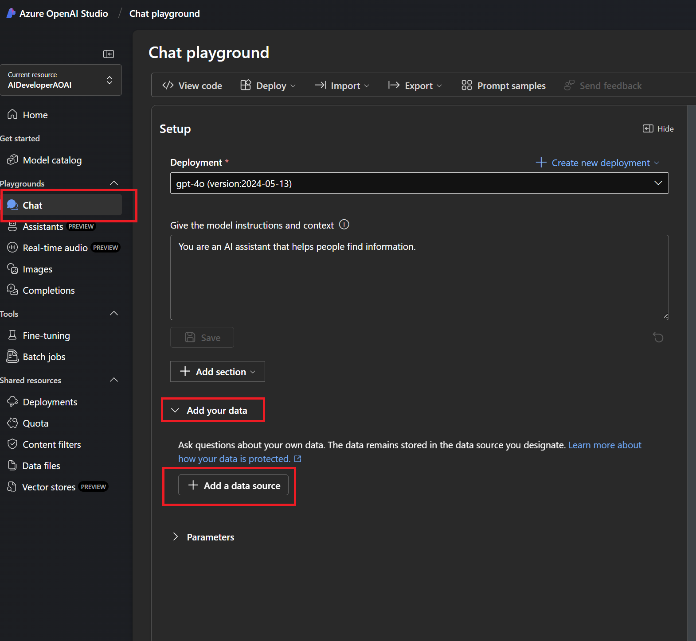
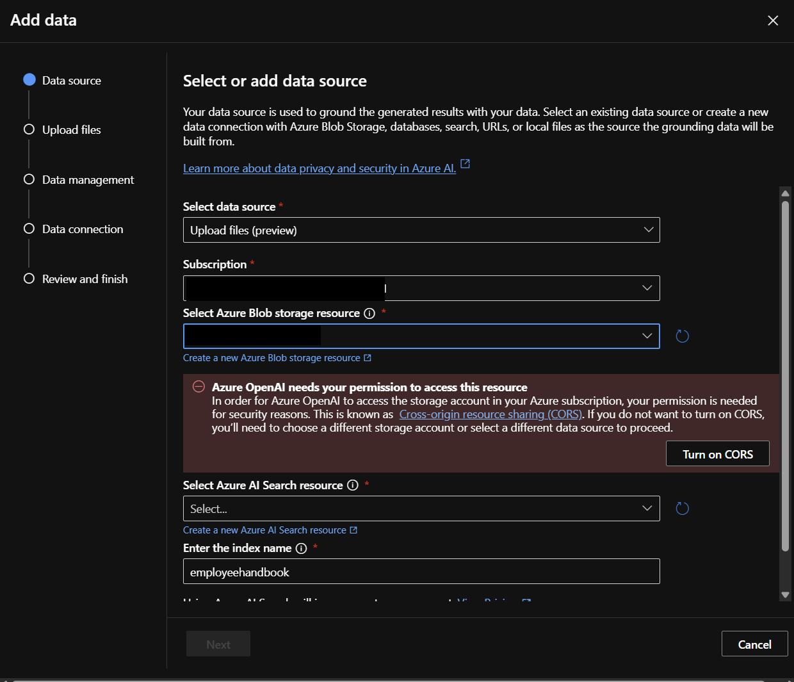
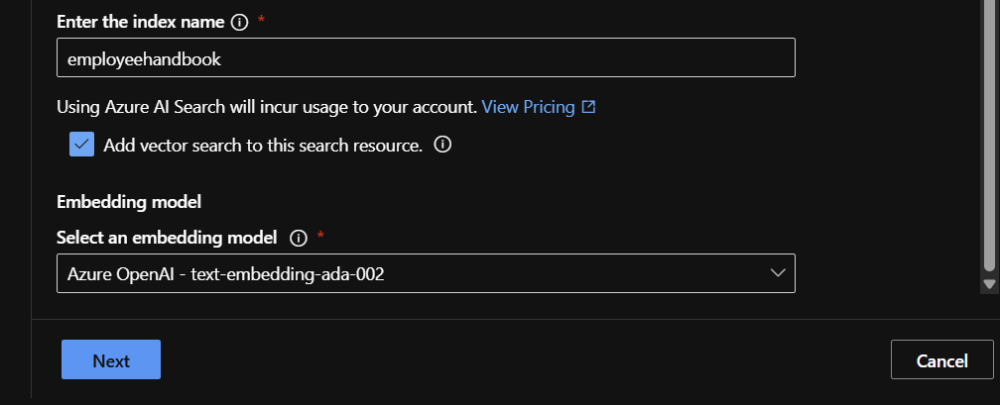
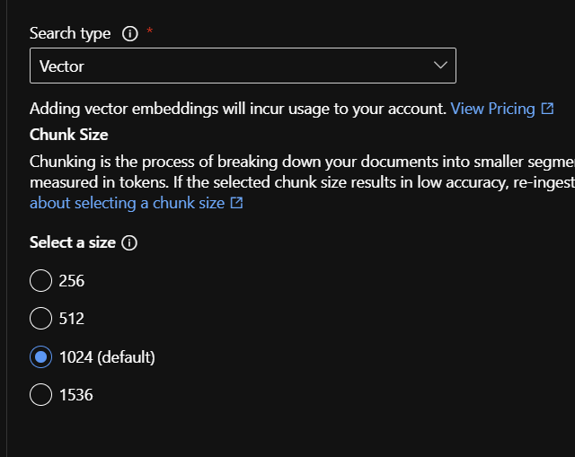
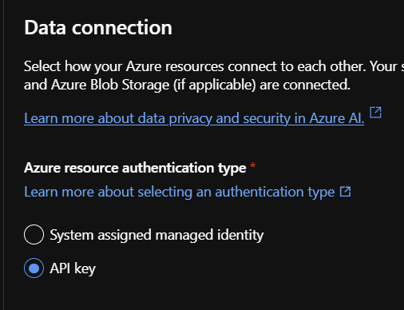
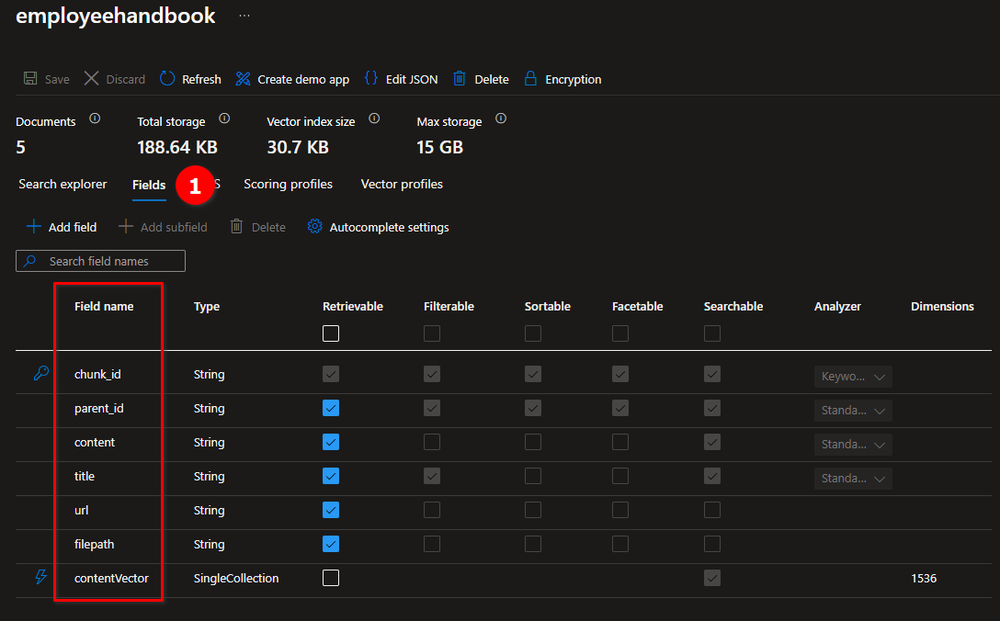

### [< Previous Challenge](./Challenge-04.md) - **[Home](../README.md)** - [Next Challenge >](./Challenge-06.md)

# Challenge 05 -  Retrieval-Augmented Generation (RAG)

## Some Background (optional)

### Retrieval-Augmented Generation (RAG)

The RAG (Retrieval-Augmented Generation) pattern is an AI model architecture that enhances the generation of text by integrating external, relevant information retrieved from a knowledge base or database, improving accuracy and context. It combines retrieval mechanisms with generative models to produce more informed and contextually relevant responses.

#### :exclamation:**IMPORTANT**

Your prompts (inputs), completions (outputs), embeddings, and training data are:

* NOT available to other customers.
* NOT available to OpenAI.
* NOT used to improve OpenAI models.
* NOT used to improve any Microsoft or 3rd party products or services.
* NOT used for automatically improving Azure OpenAI models for your use in your resource (The models are stateless, unless you explicitly fine-tune models with your training data).

> Your fine-tuned Azure OpenAI models are available exclusively for your use.
The Azure OpenAI Service is fully controlled by Microsoft; Microsoft hosts the OpenAI models in Microsoft’s Azure environment and the Service does NOT interact with any services operated by OpenAI (e.g. ChatGPT, or the OpenAI API).

For more information on Data, privacy, and security for Azure OpenAI Service visit this [Link](https://learn.microsoft.com/en-us/legal/cognitive-services/openai/data-privacy)

### Embeddings in AI

Embedding models are a way to represent complex data, like words or images, as numbers so that computers can understand and work with them more easily.

#### Here's a simple breakdown

**Representation**: Imagine you have words like "cat," "dog," and "apple." In an embedding model, each word is represented by a list of numbers (like coordinates in a space). For example, "cat" might be represented as [0.2, 0.5, 0.8] and "dog" as [0.3, 0.4, 0.9]. These numbers capture the meaning of the word in a way that the computer can process.

**Similarity**: Words with similar meanings will have similar numbers (or be close to each other in this space). For example, "cat" and "dog" might be close together, while "apple" would be farther away.

**Training**: To create these embeddings, the model is trained on lots of text. It learns patterns and relationships between words based on how they are used together. Once trained, it can represent any word as a list of numbers.

**Usage**: These embeddings are used in tasks like translating languages, finding similar items (like in a recommendation system), or even understanding sentences.

In essence, embedding models take something complex (like words or images) and turn them into a simple, consistent format (numbers) that machines can work with.

### Document Chunking

Document chunking is a technique used in AI, especially in Retrieval-Augmented Generation (RAG) models, to break down large documents into smaller, manageable pieces or “chunks.” This makes it easier for the AI to process the relevant information. Imagine you have a long book and you want to find specific information quickly. Instead of reading the entire book, you divide it into chapters or sections. Each chunk can then be indexed and searched individually, making the retrieval process faster and more efficient.

In the context of RAG, these chunks are used to enhance the AI’s ability to generate accurate and contextually relevant responses. When a query is made, the retrieval mechanism searches through these smaller chunks to find the most relevant information, which the model then uses to generate a coherent and informative answer. This method improves the performance and accuracy of AI models by ensuring they have access to the most pertinent data without being overwhelmed by the volume of information.

## Pre-requisites

Completed at least [Challenge 03](./Challenge-03.md) and have a functional version of the solution running and a good understanding of plugins.

## Introduction

In this challenge, you will create a Semantic Search Plugin that utilizes an Azure AI Search Index to retrieve information from the Contoso Handbook PDF. The purpose of the plugin is to enable the AI Model to answer questions about your own documents. We achieve this by converting the user's query into an embedding using a Text Embedding model. The embedding is then used to search the AI Search Index for the most relevant information.

## Objectives

* Deploy Azure AI Search
* Deploy Storage Account with CORS enabled
* Use AI Studio to deploy a Text Embedding model
* Import documents
* Create a Semantic Search Plugin to query the AI Search Index

### Deploy Azure AI Search

1. In the [Azure Portal](https://portal.azure.com/) search for ```AI Search``` and select **Create**.
    1. Create it in the **same resource group and location as your AI Models**.
    1. Change the pricing tier to **Basic**.
    1. Leave everything else as default, then click **Review + create**.

1. Once the AI Search resource is created, navigate to the resource.
    1. Grab the **URL** from the Overview section.
    1. Grab the **Key** from the Keys section.
    1. Add these values to the **appsettings.json** file in the reference application. You will need these values later when configuring AI Search.

    ```json
      "AI_SEARCH_URL": "Replace with your AI Search URI",
      "AI_SEARCH_KEY": "Replace with your AI Search API Key"
    ```

    :bulb: The AI Search URL and Key will be used to configure the AI Search Connector in the Semantic Search Plugin.

### Deploy Storage Account with CORS enabled

1. In the [Azure Portal](https://portal.azure.com/) search for ```Storage Account``` and select **Create**.
    1. Create it in the **same resource group and location as your AI Models**.
    1. Leave everything as default, then click **Review + create**.
1. Once the Storage Account is created, navigate to the resource. Reference this screenshot for the CORS settings below.
    1. Under the **Settings** section, click on **Resource sharing (CORS)**.
    1. Add 2 rows with the following values:
        1. Row 1:
            * Allowed origins: ```https://documentintelligence.ai.azure.com```
            * Allowed methods: ```Select All```
            * Allowed headers: ```*```
            * Exposed headers: ```*```
            * Max age: ```120```
        1. Row 2:
            * Allowed origins: ```https://oai.azure.com```
            * Allowed methods: ```GET, POST, OPTIONS, and PUT```
            * Allowed headers: ```*```
            * Exposed headers: ```*```
            * Max age: ```120```

            :bulb: If you are using AI Studio instead of Azure Open AI Studio, you will need to change the origin to ```https://ai.azure.com```.

    1. Click **Save**.

    

### Use AI Studio to deploy a Text Embedding model

1. Using [Azure AI Studio](https://ai.azure.com/resource/deployments), deploy a *Standard* **text-embedding-ada-002** model in the same deployment as your previous GPT-4o model. Once deployed, add the **Embedding Deployment Model Name** as a new setting to the **appsettings.json** file in the reference application. You will need this value later when configuring the Semantic Search Plugin.

    

2. Add the **Embedding Deployment Model Name** to the **.env** file in the reference application.

    ```json
    "EMBEDDINGS_DEPLOYMODEL": "text-embedding-ada-002"
    ```

    :bulb: This model will be used to translate your documents and queries into embeddings (see above)

### Import documents

1. In Azure OpenAI Studio click on Chat -> Add Your Data -> Add Data Source

    

1. Select Data Source = ```Upload Files```.
1. Select the existing Blob Storage resource you created earlier.
1. Click **Turn on CORS** if prompted.
1. Choose the **AI Search Resource** setup in the previous step.
1. For the Index Name use:

    ```text
    employeehandbook
    ```

    > :bulb: The AI Search Index Name will be needed by the reference application

    

1. Check **Add Vector Search**
1. Select the **text-embedding-ada-002** model created previously
1. Click Next

    

1. Upload the ```employee_handbook.pdf``` from the **..\data** directory and **click Next**
1. Set the Search type to **Vector** and the Chunk Size to **1024** then **click Next**

  > :bulb: Chunk size refers to how much text is grouped together into a single segment or "chunk" before creating an embedding. When processing large documents, the text is often divided into smaller chunks to create embeddings for each segment. The chunk size determines how much text is included in each embedding.
  >
  > Choosing the right chunk size is important: if chunks are too large, important details might get lost or diluted in the embedding; if too small, the system might miss out on essential context. The chunk size thus impacts the accuracy and relevance of the information retrieved and subsequently used in generating responses

  

1. Set the Resource Authentication Type to **API Key**

    

    :repeat: Click **Next** and wait for the import to finish

### Create a Semantic Search Plugin to query the AI Search Index

1. Navigate back to the reference application and open the **chat.py** file. Register the service for Azure OpenAI Text Embedding Generation with the Kernel.

    :bulb: As an example, look at how you registered the AzureOpenAIChatCompletion service. Also note the 3 variables you added to the .env file: EMBEDDINGS_DEPLOYMODEL, AOI_ENDPOINT, AOI_API_KEY.

1. Register the AI Search and the *Azure AI Search Vector Store connector* with the Kernel Builder. The connector is configured with the URL and API key of the Azure AI Search service.

    :bulb: There are several ways to add the AI Search Connector to Semantic Kernel. Follow the instructions using the **kernelBuilder**.
  
    * Refer to the [documentation](https://learn.microsoft.com/en-us/semantic-kernel/concepts/vector-store-connectors/out-of-the-box-connectors/azure-ai-search-connector?pivots=programming-language-python#getting-started) for more information on how to configure the connector.
    * Be sure to use the code sample where the ```SearchIndexClient``` is registered separately, you will need this class in your plugin
    * Also note the 2 environment variables you added to the .env file: AI_SEARCH_URL, AI_SEARCH_KEY.

1. Create a new class in the **Plugins** folder called **ContosoSearchPlugin.cs**. This is the Semantic Search Plugin to query the AI Search Index created earlier. This Plugin should take the users query and generate an embedding using the Text Embedding model. The embedding should then be used to query the AI Search Index containing the Contoso Handbook PDF and return the most relevant information.

    :bulb: Review the Semantic Kernel documentation on [Creating a Retrieval Augmented Generation (RAG) plugin](https://learn.microsoft.com/en-us/semantic-kernel/concepts/plugins/using-data-retrieval-functions-for-rag) for more information on how to create a ***Semantic Search*** Plugin.

1. The Sample RAG Plugin in the documentation maps the incoming data from AI Search to a class named ```EmployeeHandbookModel```.

    The properties on this class map to fields in the AI Search Index we created earlier. In the portal, you can navigate to the AI Search Index and see the fields that are available.
    

    :bulb: Note that the vector field to search is named ```contentVector``` but the sample code from the documentation uses ```vector```, **you will need to update the code to use the correct field name.**

1. Add the plugin to Semantic Kernel using the ```add_plugins``` method.

    Below is the workflow handled by Semantic Kernel and your plugin:

    ```mermaid
    sequenceDiagram
        participant C as Client
        participant S as Semantic Kernel
        participant A as AI
        box Contoso Search Plugin 
            participant P as Plugin
            participant E as Embedding
            participant Search as Azure AI Search
        end
        C->>S: What are the steps for the Contoso Performance Reviews?
        activate C
        S->>+A: What are the steps for the Contoso Performance Reviews?
        A-->>-S: Call contoso_search function
        S->>+P: Query: Steps for the Contoso Performance Reviews?
        P->>+E: Convert query to Embedding
        E-->>-P: Embedding [19,324,12,.......]
        P->>+Search: Search Documents using Embedding
        Search-->>-P: Related Documents
        P-->>-S: Here are the related documents
        S->>+A: Results of contoso_search
        A-->>-S: The steps for the Contoso Performance Reviews are ...
        S->>C: Here are the steps for the Contoso Performance Reviews
        deactivate C
    ```

1. Test the Plugin

    Set a breakpoint in your plugin to verify that the Contoso search function is being called correctly. Review the incoming query, the generated embedding, and the search results returned from the AI Search Index.

    Test the plugin by running the applications and asking the Chatbot questions about the Contoso Handbook. The Chatbot should be able to answer questions similar to the following:

    * ```text
        What are the steps for the Contoso Performance Reviews?
       ```

    * ```text
        What is Contoso's policy on Data Security?
      ```

    * ```text
        Who do I contact at Contoso for questions regarding workplace safety?
      ```

## Success Criteria

1. Verify that you deployed the text-embedding-ada-002 Text Embedding model in Azure OpenAI Studio
1. Verify that you deployed an AI Search Index and imported the Contoso Handbook PDF
1. Verify that the Chatbot is able to answer questions about the Contoso Handbook by querying the AI Search Index using the Semantic Search Plugin

## Additional Learning Resources

* [Semantic Kernel Blog](https://devblogs.microsoft.com/semantic-kernel/)
* [ChatGPT + Enterprise data with Azure OpenAI and Cognitive Search](https://github.com/Azure-Samples/azure-search-openai-demo)
* [Build Industry-Specific LLMs Using Retrieval Augmented Generation](https://towardsdatascience.com/build-industry-specific-llms-using-retrieval-augmented-generation-af9e98bb6f68)

## Advanced Challenges (Optional)

**These are optional challenges for those who want to further explore the capabilities of Semantic Search and plugins.**

* Delete the AI Search Index and re-upload the Employee Handbook PDF changing the **chunk size**. Experiment with different chunk sizes and see how it affects the search results.
* Update the Semantic Search Plugin to return the top 3 most relevant search results, instead of just the top result.

### [< Previous Challenge](./Challenge-04.md) - **[Home](../README.md)** - [Next Challenge >](./Challenge-06.md)
